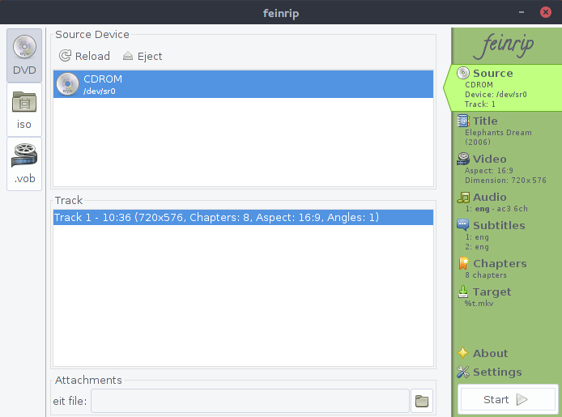

# Feinrip

Feinrip is a GUI frontend for converting mpeg files to mkv files.

It is written in Java and runs on Linux systems. It may run on Mac and (with a few tweaks) on Windows. If you made it run on these OS, please send in a patch.

## Documentation

See the [online documentation](http://www.shredzone.org/maven/feinrip/) for more examples.

## Contribute

* Fork the [Source code at GitHub](https://github.com/shred/feinrip). Feel free to send pull requests.
* Found a bug? [File a bug report!](https://github.com/shred/feinrip/issues)

## Licenses

Feinrip consists of three modules.

`feinrip-gui` is distributed under the terms of [GNU General Public License V3](http://www.gnu.org/licenses/gpl-3.0.html).

`feinrip-dvb` and `feinrip-lsdvd` are distributed under the terms of [GNU Lesser General Public License Version 3](http://www.gnu.org/licenses/lgpl-3.0.html).

Font: ["Calligraffiti" by _Font Squirrel_](http://www.fontsquirrel.com/fonts/calligraffiti), distributed under the terms of Apache License V2.

Icons: ["GNOME icon theme" by _The GNOME Project_](http://www.gnome.org), distributed under the terms of GNU Lesser General Public License V3 or Creative Commons BY-SA 3.0 license.
